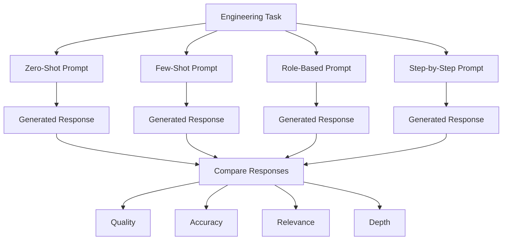

# EXPERIMENT 5

## COMPARATIVE ANALYSIS OF DIFFERENT TYPES OF PROMPTING PATTERNS AND EXPLANATION WITH VARIOUS TEST SCENARIOS

### AIM

To study, test, and compare different prompting patterns using various test scenarios and analyze their effect on the **quality, accuracy, relevance, consistency, and depth** of AI-generated responses.

### AI TOOLS REQUIRED

* ChatGPT
* Google Gemini
* Any Generative AI Tool

---

## 1. INTRODUCTION

Prompting is the process of providing instructions to a Generative AI model to obtain a desired output. Different prompting patterns can influence how an AI model understands a task and generates its response.

In this experiment, different prompting patterns are applied to multiple scenarios. The responses are compared to identify which prompting pattern is more effective for a particular type of task.

The following prompting patterns are considered:

1. **Zero-Shot Prompting**
2. **Few-Shot Prompting**
3. **Role-Based Prompting**
4. **Step-by-Step Prompting**

---

## 2. TYPES OF PROMPTING PATTERNS

### 2.1 Zero-Shot Prompting

Zero-shot prompting asks the AI to perform a task without providing examples.

**Example:**

> Explain how an automatic street-light system works.

---

### 2.2 Few-Shot Prompting

Few-shot prompting provides one or more examples before asking the AI to perform the required task.

**Example:**

> Example:
> Input: 20°C → Fan OFF
> Input: 40°C → Fan ON
>
> Determine the output when the temperature is 35°C.

---

### 2.3 Role-Based Prompting

Role-based prompting assigns a specific professional or expert role to the AI.

**Example:**

> Act as an embedded systems engineer and explain how an automatic street-light controller can be designed using a microcontroller.

---

### 2.4 Step-by-Step Prompting

Step-by-step prompting asks the AI to approach a problem through a sequence of logical stages.

**Example:**

> Explain the design of an automatic street-light system step by step, including input, processing, decision-making, and output.

---

## 3. PROMPTING PATTERN WORKFLOW

---

## 4. TEST SCENARIO 1 – SMART PARKING SYSTEM

### Task

Design a system that identifies available parking spaces and guides vehicles to empty slots.

### Zero-Shot Prompt

> Design a smart parking system.

### Few-Shot Prompt

> Example: Sensor detects vehicle → Slot occupied.
> Example: Sensor detects no vehicle → Slot available.
> Design a smart parking system using similar logic.

### Role-Based Prompt

> Act as an IoT engineer and design a smart parking system using sensors, a microcontroller, and a display unit.

### Step-by-Step Prompt

> Explain step by step how to design a smart parking system, including sensing, processing, decision-making, slot identification, and user notification.

### Observation

The zero-shot prompt gives a general solution. Few-shot prompting improves consistency by providing examples. Role-based prompting gives a more domain-specific solution, while step-by-step prompting provides a more organized design process.

---

## 5. TEST SCENARIO 2 – TEMPERATURE MONITORING

### Task

Develop a system that monitors temperature and activates a cooling mechanism when the temperature exceeds a threshold.

### Zero-Shot Prompt

> Create a temperature monitoring system.

### Few-Shot Prompt

> Example: 25°C → Fan OFF.
> Example: 40°C → Fan ON.
> Create a similar temperature control system.

### Role-Based Prompt

> Act as an embedded systems engineer and develop a temperature monitoring system using a temperature sensor and microcontroller.

### Step-by-Step Prompt

> Explain step by step how to sense temperature, compare it with a threshold value, and control a cooling fan.

### Observation

Few-shot prompting is useful for defining input-output behavior, while role-based and step-by-step prompting provide more technical and structured responses.

---

## 6. TEST SCENARIO 3 – STUDENT PERFORMANCE CLASSIFICATION

### Task

Classify student performance based on examination marks.

### Zero-Shot Prompt

> Analyze student performance based on marks.

### Few-Shot Prompt

> Example: 90 marks → Excellent.
> Example: 70 marks → Good.
> Example: 50 marks → Average.
> Classify students using the same pattern.

### Role-Based Prompt

> Act as an academic performance analyst and classify students according to their examination marks.

### Step-by-Step Prompt

> Analyze student marks step by step, define suitable performance ranges, and classify each student according to the calculated range.

### Observation

Few-shot prompting provides clear classification behavior, while step-by-step prompting makes the classification process easier to understand.

---

## 7. TEST SCENARIO 4 – PYTHON PROGRAM GENERATION

### Task

Generate a Python program to determine whether a number is prime.

### Zero-Shot Prompt

> Write Python code to check whether a number is prime.

### Few-Shot Prompt

> Example: 7 → Prime
> Example: 10 → Not Prime
> Write a Python program that follows this behavior.

### Role-Based Prompt

> Act as a Python programming instructor and write a simple prime-number checking program for beginners.

### Step-by-Step Prompt

> Develop a Python program to check whether a number is prime. Explain the algorithm, conditions, and program execution step by step.

### Observation

Role-based prompting improves the teaching aspect of the response, while step-by-step prompting provides a clearer understanding of the programming logic.

---

## 8. TEST SCENARIO 5 – TRAFFIC MANAGEMENT

### Task

Develop an intelligent system for reducing traffic congestion.

### Zero-Shot Prompt

> How can traffic congestion be reduced using AI?

### Few-Shot Prompt

> Example: Traffic camera data → Detect vehicle density.
> Example: High vehicle density → Increase green-light duration.
> Suggest an AI-based traffic management system using similar logic.

### Role-Based Prompt

> Act as an AI and IoT engineer and design an intelligent traffic management system using cameras, sensors, and real-time data analysis.

### Step-by-Step Prompt

> Explain step by step how an AI-based traffic management system can detect congestion, analyze traffic density, make decisions, and control traffic signals.

### Observation

Role-based prompting provides a professional engineering perspective, while step-by-step prompting produces a more complete system workflow.

---

## 9. COMPARATIVE ANALYSIS

| Prompting Pattern | Clarity   | Detail    | Consistency | Technical Depth | Best Application      |
| ----------------- | --------- | --------- | ----------- | --------------- | --------------------- |
| Zero-Shot         | Medium    | Medium    | Medium      | Medium          | Simple tasks          |
| Few-Shot          | High      | High      | Very High   | High            | Classification        |
| Role-Based        | High      | High      | High        | Very High       | Domain-specific tasks |
| Step-by-Step      | Very High | Very High | High        | Very High       | Complex problems      |

---

## 10. RESPONSE EVALUATION

The generated responses are evaluated using the following criteria:

### Quality

Measures the clarity, organization, completeness, and usefulness of the response.

### Accuracy

Measures whether the information or solution provided by the AI is technically and factually correct.

### Relevance

Measures how closely the generated response follows the given prompt.

### Depth

Measures the amount of explanation, reasoning, and useful technical detail provided.

### Consistency

Measures whether the AI produces similar-quality responses when given similar inputs.

---

## 11. OVERALL RESULTS

| Scenario               | Zero-Shot | Few-Shot  | Role-Based | Step-by-Step | Best Pattern              |
| ---------------------- | --------- | --------- | ---------- | ------------ | ------------------------- |
| Smart Parking          | Good      | Very Good | Excellent  | Excellent    | Role-Based / Step-by-Step |
| Temperature Monitoring | Good      | Excellent | Excellent  | Excellent    | Few-Shot / Step-by-Step   |
| Student Classification | Good      | Excellent | Very Good  | Excellent    | Few-Shot                  |
| Python Programming     | Good      | Very Good | Excellent  | Excellent    | Role-Based / Step-by-Step |
| Traffic Management     | Good      | Very Good | Excellent  | Excellent    | Step-by-Step              |

---

## 12. OBSERVATIONS

The experiment produced the following observations:

1. Zero-shot prompting is simple and effective for straightforward tasks.
2. Few-shot prompting improves consistency by providing examples.
3. Role-based prompting helps the AI generate domain-specific responses.
4. Step-by-step prompting is useful for complex engineering problems.
5. Different prompting patterns produce different levels of detail.
6. The best prompting pattern depends on the nature of the task.
7. Combining multiple prompting techniques can produce highly structured outputs.

---

## 13. APPLICATIONS

Different prompting patterns can be used in:

* Embedded system design
* Software development
* IoT applications
* Data analysis
* Academic learning
* Engineering problem solving
* Technical documentation
* Debugging
* Classification systems
* Project planning

---

## 14. ADVANTAGES

* Improves interaction with Generative AI.
* Helps obtain task-specific responses.
* Reduces ambiguity in complex problems.
* Improves response organization.
* Supports technical and academic learning.
* Makes AI tools more useful for engineering applications.

---

## 15. LIMITATIONS

* AI responses may still contain incorrect information.
* Few-shot prompting requires suitable examples.
* Step-by-step prompts can produce unnecessarily long responses.
* Role-based prompting does not guarantee expert-level accuracy.
* The quality of the output depends on the quality of the input prompt.

---

## 16. KEY FINDINGS

The experiment demonstrates that there is no single prompting pattern that is best for every situation.

* **Zero-shot prompting** is suitable for simple tasks.
* **Few-shot prompting** is useful when examples or patterns are important.
* **Role-based prompting** works well for professional and domain-specific tasks.
* **Step-by-step prompting** is effective for complex problem-solving tasks.

Therefore, selecting the appropriate prompting pattern according to the task can improve the quality and usefulness of AI-generated responses.

---

## 17. CONCLUSION

The comparative study of different prompting patterns was successfully carried out using multiple test scenarios. The experiment demonstrated that changing the prompting pattern can significantly influence the structure, relevance, consistency, and depth of AI-generated responses.

Zero-shot prompting provides quick general responses, few-shot prompting improves pattern-based outputs, role-based prompting provides domain-oriented responses, and step-by-step prompting is useful for complex problem solving.

Hence, effective prompt engineering requires selecting the **appropriate prompting pattern based on the task, context, and expected output**.

---

## RESULT

**The different prompting patterns were successfully tested and compared across various test scenarios. The experiment demonstrated that selecting a suitable prompting pattern improves the quality, relevance, consistency, and depth of AI-generated responses.**
