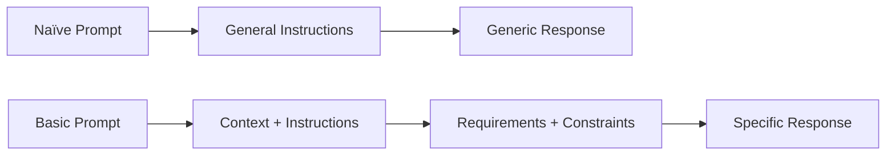
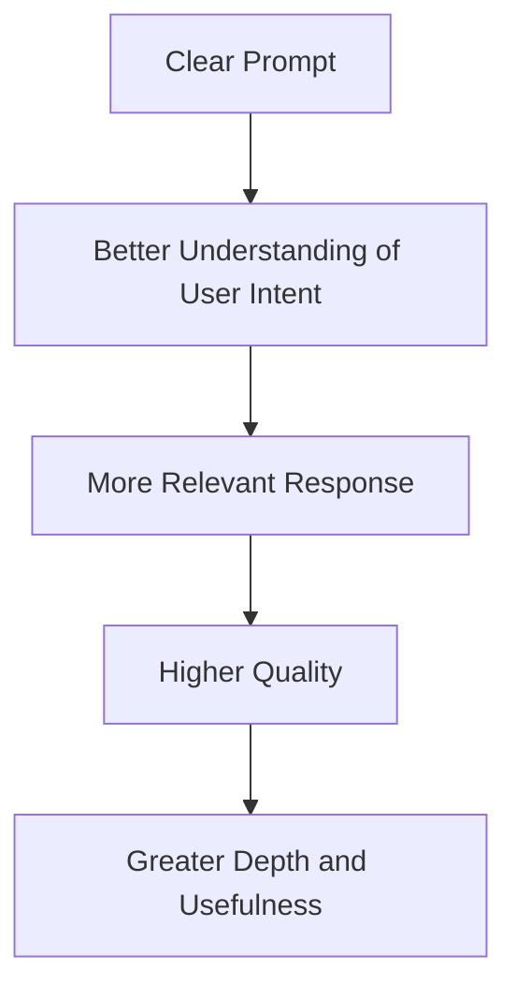

# EXP 5: COMPARATIVE ANALYSIS OF DIFFERENT TYPES OF PROMPTING PATTERNS AND EXPLAIN WITH VARIOUS TEST SCENARIOS

# EXPERIMENT 5

## COMPARATIVE ANALYSIS OF NAÏVE AND BASIC PROMPTING USING VARIOUS TEST SCENARIOS

---

## AIM

To compare the performance of **naïve and basic prompts** in ChatGPT across different test scenarios and to analyze the generated responses based on **quality, accuracy, relevance, and depth**.

---

## AI TOOL REQUIRED

* ChatGPT

---

## 1. INTRODUCTION

Prompting is the process of providing instructions to an Artificial Intelligence model to obtain a desired response. The structure and clarity of a prompt can influence how effectively the AI understands the user's requirements.

In this experiment, two different prompting approaches are tested:

* **Naïve Prompting** – short, broad, and less structured prompts.
* **Basic Prompting** – clear, detailed, and structured prompts containing specific instructions and context.

The same task is given to ChatGPT using both prompt types. The generated responses are then compared to understand how prompt structure affects the quality of the output.

---

## 2. DEFINITION OF THE TWO PROMPT TYPES

### 2.1 Naïve Prompt

A naïve prompt is a simple and general instruction that provides limited context or specific requirements to the AI model.

**Example:**

> Explain artificial intelligence.

This prompt allows ChatGPT to decide what information should be included and how the answer should be presented.

### 2.2 Basic Prompt

A basic prompt is a clear, detailed, and structured instruction that provides context, requirements, constraints, and the expected format of the response.

**Example:**

> Explain artificial intelligence for a first-year engineering student. Define AI, list three common applications, and provide one simple real-world example. Present the answer using headings and bullet points.

The basic prompt gives ChatGPT a clearer understanding of the expected response.

---

## 3. COMPARISON OF PROMPT TYPES

| Feature            | Naïve Prompt  | Basic Prompt      |
| ------------------ | ------------- | ----------------- |
| Structure          | Unstructured  | Structured        |
| Context            | Limited       | Clearly provided  |
| Instructions       | General       | Specific          |
| Output Control     | Low           | High              |
| Expected Detail    | Not specified | Clearly specified |
| Response Relevance | Moderate      | High              |

---

## 4. PROMPT COMPARISON



---

## 5. PREPARATION OF TEST SCENARIOS

Eight different scenarios were selected to evaluate the performance of ChatGPT across creative, academic, technical, and practical tasks.

### Selected Scenarios

1. Creative story generation
2. Factual explanation
3. Concept summarization
4. Study advice
5. Python programming
6. Project recommendation
7. Professional email writing
8. Engineering problem solving

For every scenario, two prompts were prepared:

* One naïve prompt
* One basic prompt

Both prompts target the **same task**, but the basic prompt contains more specific instructions.

---

# 6. SCENARIO 1 – CREATIVE STORY GENERATION

### Naïve Prompt

> Write a story about a robot.

### Basic Prompt

> Write a 250-word science-fiction story about a robot that helps students in a school during an unexpected power failure. Include a clear beginning, problem, solution, and positive ending.

### Response Comparison

| Parameter  | Naïve Prompt | Basic Prompt |
| ---------- | ------------ | ------------ |
| Quality    | Moderate     | High         |
| Relevance  | General      | Very High    |
| Creativity | Good         | Very Good    |
| Depth      | Low          | High         |

### Observation

The naïve prompt produces a general story about a robot. The basic prompt generates a more focused story because it specifies the setting, character, situation, length, and required story structure.

---

# 7. SCENARIO 2 – FACTUAL QUESTION

### Naïve Prompt

> What is cloud computing?

### Basic Prompt

> Explain cloud computing for an engineering student. Define cloud computing, explain IaaS, PaaS, and SaaS, and provide one practical example for each service model.

### Response Comparison

| Parameter    | Naïve Prompt | Basic Prompt |
| ------------ | ------------ | ------------ |
| Accuracy     | Good         | High         |
| Detail       | Moderate     | High         |
| Organization | Basic        | Excellent    |
| Usefulness   | Moderate     | High         |

### Observation

The naïve prompt produces a general explanation. The basic prompt gives a more complete answer because it specifies the concepts that must be covered.

---

# 8. SCENARIO 3 – CONCEPT SUMMARIZATION

### Naïve Prompt

> Summarize machine learning.

### Basic Prompt

> Summarize machine learning in approximately 150 words. Include its definition, three major types, common applications, and one limitation. Use simple language suitable for a college student.

### Response Comparison

| Parameter            | Naïve Prompt | Basic Prompt |
| -------------------- | ------------ | ------------ |
| Relevance            | Moderate     | High         |
| Conciseness          | Moderate     | High         |
| Information Coverage | Low          | High         |
| Depth                | Moderate     | High         |

### Observation

The basic prompt provides better control over the length and content of the summary.

---

# 9. SCENARIO 4 – STUDY ADVICE

### Naïve Prompt

> How can I study better?

### Basic Prompt

> Create a practical one-week study plan for a college student preparing for three technical subjects. Allocate two hours per day, include revision and practice sessions, and provide short breaks between study sessions.

### Response Comparison

| Parameter       | Naïve Prompt | Basic Prompt |
| --------------- | ------------ | ------------ |
| Practicality    | Moderate     | Very High    |
| Personalization | Low          | High         |
| Structure       | Low          | High         |
| Usefulness      | Moderate     | Very High    |

### Observation

The naïve prompt generates general study suggestions, whereas the basic prompt produces a more actionable plan because specific time and scheduling requirements are provided.

---

# 10. SCENARIO 5 – PYTHON PROGRAMMING

### Naïve Prompt

> Write Python code for a calculator.

### Basic Prompt

> Write a beginner-friendly Python calculator program that accepts two numbers and performs addition, subtraction, multiplication, and division. Use separate functions for each operation and display the result clearly.

### Response Comparison

| Parameter             | Naïve Prompt | Basic Prompt |
| --------------------- | ------------ | ------------ |
| Code Relevance        | Moderate     | High         |
| Structure             | Moderate     | High         |
| Explanation           | Low          | High         |
| Beginner Friendliness | Moderate     | Very High    |

### Observation

The basic prompt provides clear programming requirements, resulting in an output that is more closely aligned with the requested functionality.

---

# 11. SCENARIO 6 – PROJECT RECOMMENDATION

### Naïve Prompt

> Suggest some project ideas.

### Basic Prompt

> Suggest five mini-project ideas for an Electronics and Communication Engineering student. Focus on Arduino, sensors, IoT, and embedded systems. For each project, provide the objective, major components, and expected outcome.

### Response Comparison

| Parameter       | Naïve Prompt | Basic Prompt |
| --------------- | ------------ | ------------ |
| Relevance       | Low          | Very High    |
| Specificity     | Low          | High         |
| Practical Value | Moderate     | Very High    |
| Depth           | Low          | High         |

### Observation

The basic prompt provides project ideas that are more relevant to the specified engineering domain and includes useful implementation information.

---

# 12. SCENARIO 7 – PROFESSIONAL EMAIL WRITING

### Naïve Prompt

> Write an email asking for leave.

### Basic Prompt

> Write a professional email to a college faculty member requesting two days of leave due to a personal reason. Keep it polite and concise and include the leave dates and a request for approval.

### Response Comparison

| Parameter    | Naïve Prompt | Basic Prompt |
| ------------ | ------------ | ------------ |
| Tone         | General      | Professional |
| Completeness | Moderate     | High         |
| Relevance    | Moderate     | High         |
| Clarity      | Good         | Very Good    |

### Observation

The basic prompt produces a more appropriate email because it specifies the recipient, purpose, duration, tone, and required information.

---

# 13. SCENARIO 8 – ENGINEERING PROBLEM SOLVING

### Naïve Prompt

> How can traffic congestion be reduced?

### Basic Prompt

> Suggest technological solutions for reducing traffic congestion in a large city. Include three AI or IoT-based solutions, explain how each works, and mention one advantage and one limitation for each solution.

### Response Comparison

| Parameter        | Naïve Prompt | Basic Prompt |
| ---------------- | ------------ | ------------ |
| Technical Detail | Low          | High         |
| Relevance        | Moderate     | High         |
| Depth            | Moderate     | High         |
| Practicality     | Moderate     | Very High    |

### Observation

The basic prompt produces more detailed and practical solutions because it specifies the technology, number of solutions, explanation requirements, advantages, and limitations.

---

# 14. OVERALL COMPARATIVE TABLE

| S.No | Test Scenario          | Naïve Prompt Result | Basic Prompt Result          | Better Result |
| ---: | ---------------------- | ------------------- | ---------------------------- | ------------- |
|    1 | Creative Story         | General story       | Focused and structured story | Basic         |
|    2 | Factual Explanation    | General explanation | Detailed explanation         | Basic         |
|    3 | Summarization          | Broad summary       | Controlled summary           | Basic         |
|    4 | Study Advice           | General suggestions | Actionable study plan        | Basic         |
|    5 | Python Programming     | Simple program      | Requirement-based program    | Basic         |
|    6 | Project Recommendation | Generic ideas       | Domain-specific ideas        | Basic         |
|    7 | Email Writing          | Basic email         | Professional email           | Basic         |
|    8 | Problem Solving        | General solutions   | Detailed technical solutions | Basic         |

---

# 15. EVALUATION PARAMETERS

The generated responses were evaluated using four major parameters.

| Evaluation Parameter | Description                                                    |
| -------------------- | -------------------------------------------------------------- |
| **Quality**          | Clarity, organization, coherence, and overall response quality |
| **Accuracy**         | Correctness of the information provided                        |
| **Relevance**        | How closely the response follows the requested task            |
| **Depth**            | Amount of useful explanation, detail, and insight              |

---

# 16. EVALUATION SUMMARY

| Parameter            | Naïve Prompting | Basic Prompting |
| -------------------- | --------------- | --------------- |
| Quality              | Moderate        | High            |
| Accuracy             | Moderate        | High            |
| Relevance            | Moderate        | Very High       |
| Depth                | Low to Moderate | High            |
| Output Control       | Low             | High            |
| Practical Usefulness | Moderate        | High            |

---

# 17. ANALYSIS OF RESULTS

The comparison shows that the structure of a prompt has a noticeable effect on the response generated by ChatGPT.

Naïve prompts generally produce broad responses because they do not provide enough information about the user's exact requirements. The AI has to determine the expected format, level of detail, and scope on its own.

Basic prompts generally produce more relevant and organized responses because they provide specific instructions, context, constraints, and expected output formats.

The improvement is particularly noticeable in **programming, technical problem solving, recommendations, and academic tasks**, where specific requirements are important.

---

## 18. EFFECT OF PROMPT CLARITY



---

# 19. DOES BASIC PROMPTING ALWAYS PRODUCE BETTER RESULTS?

Basic prompting does not necessarily produce a better response in every situation.

For simple questions and open-ended creative tasks, naïve prompts can sometimes produce satisfactory results.

For example:

> Give me some names for a robot.

This is a simple task where additional instructions may not be necessary.

However, when a task requires **specific information, formatting, constraints, technical details, or a particular audience**, a basic prompt is generally more effective.

Therefore, the best prompting method depends on the complexity and requirements of the task.

---

# 20. ADVANTAGES OF NAÏVE PROMPTING

* Easy and quick to write.
* Requires minimal planning.
* Useful for brainstorming.
* Suitable for simple questions.
* Can encourage open-ended creative responses.

---

# 21. ADVANTAGES OF BASIC PROMPTING

* Provides better control over the response.
* Improves relevance.
* Helps organize the generated information.
* Provides greater depth.
* Allows specific output formats.
* Useful for technical and academic tasks.
* Helps communicate the user's requirements clearly.

---

# 22. LIMITATIONS OF NAÏVE PROMPTING

Naïve prompting can produce:

* Generic responses
* Unclear structure
* Insufficient detail
* Unwanted information
* Less personalized results
* Incomplete coverage of requirements

---

# 23. GUIDELINES FOR WRITING EFFECTIVE BASIC PROMPTS

An effective basic prompt can include the following elements:

```text
CONTEXT
   ↓
TASK
   ↓
REQUIREMENTS
   ↓
CONSTRAINTS
   ↓
OUTPUT FORMAT
```

### Example

Instead of:

> Explain IoT.

A refined prompt can be:

> Explain IoT to a first-year engineering student. Define IoT, explain its basic architecture, provide three applications, and present the answer using headings and bullet points.

The refined version gives the AI a clear target and reduces ambiguity.

---

# 24. KEY FINDINGS

1. Naïve prompts are simple and require less effort.
2. Basic prompts generally provide more relevant responses.
3. Providing context improves the AI's understanding of the task.
4. Specific instructions improve the quality of the generated output.
5. Defining the expected format improves organization.
6. Adding constraints helps control the response.
7. Basic prompting is particularly useful for technical and academic tasks.
8. Naïve prompts can still be effective for simple and creative tasks.
9. The ideal prompt depends on the complexity of the task.
10. Effective prompt engineering focuses on **clarity rather than unnecessary length**.

---

# 25. SUMMARY

The experiment compared naïve and basic prompting techniques using eight different scenarios. Each scenario was tested using two prompts that targeted the same task but differed in their level of structure and detail.

The results showed that basic prompts generally generated responses with better **quality, accuracy, relevance, depth, and usefulness**. Naïve prompts were effective for simple and open-ended tasks but provided less control over the final output.

The experiment demonstrates that providing appropriate context, clear instructions, requirements, constraints, and output formats can improve interaction with ChatGPT.

---

# 26. CONCLUSION

The comparative study successfully demonstrated the effect of prompt structure on AI-generated responses. Naïve prompts are suitable when the task is simple or when the user wants an open-ended response. Basic prompts are more suitable when specific, detailed, accurate, and structured information is required.

Thus, effective prompt engineering does not mean creating unnecessarily long prompts. Instead, it involves providing **clear context, precise instructions, relevant constraints, and an appropriate output format** according to the task.

---

# RESULT

**The comparative analysis of naïve and basic prompting was successfully performed using multiple test scenarios. The results demonstrated that basic prompts generally produced more relevant, organized, detailed, and useful responses, while naïve prompts were sufficient for simple and open-ended tasks.**

