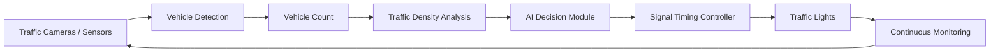
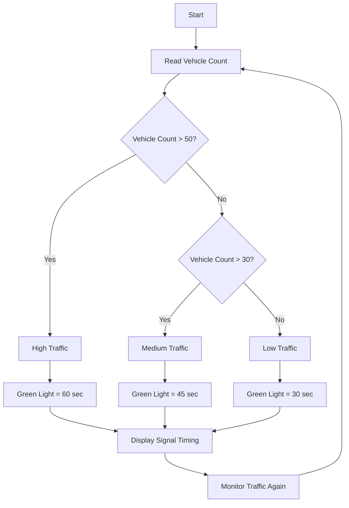
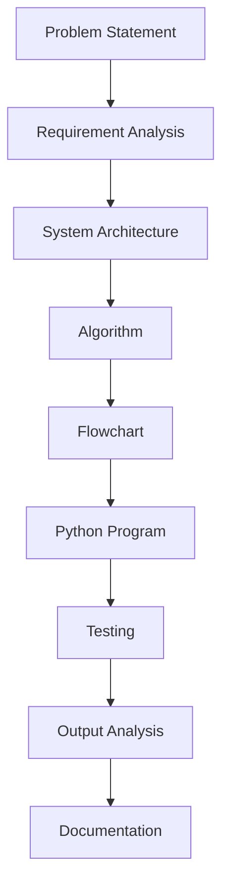
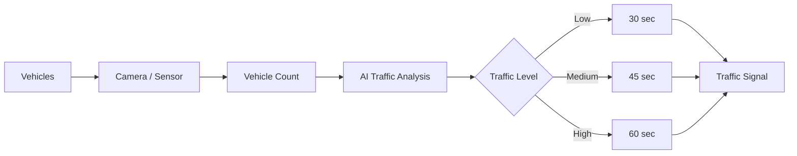

# EXPERIMENT 5

# AI-BASED SMART TRAFFIC SYSTEM USING DIFFERENT PROMPTING PATTERNS

---

## AIM

To design an **AI-based Smart Traffic System** using different prompting patterns and compare how various prompts help generate the problem analysis, system design, algorithm, Python program, testing procedure, and documentation.

---

## AI TOOLS REQUIRED

* ChatGPT
* Python
* GitHub

---

## OBJECTIVE

To apply different prompting patterns to the same engineering problem and study how the generated outputs differ.

The following prompting patterns are used:

1. Zero-Shot Prompting
2. Few-Shot Prompting
3. Role-Based Prompting
4. Step-by-Step Prompting

---

# 1. PROBLEM STATEMENT

Traditional traffic signals operate using fixed timing. This can result in unnecessary waiting when one road has heavy traffic while another road has very few vehicles.

The objective is to design an **AI-based Smart Traffic System** that monitors vehicle density and dynamically adjusts traffic signal timing according to the traffic level.

The system should:

* Detect the number of vehicles.
* Classify traffic density.
* Assign suitable green-light duration.
* Give more time to roads with heavier traffic.
* Continuously monitor traffic conditions.

---

# 2. PROMPTING PATTERN USED

## Zero-Shot Prompt

> Design an AI-based smart traffic system that reduces traffic congestion.

### Generated Output

The AI suggests a traffic management system that uses sensors or cameras to detect vehicle density and dynamically control traffic signals.

---

## Few-Shot Prompt

> Consider the following examples:
>
> Low traffic → 30 seconds green light
> Medium traffic → 45 seconds green light
> High traffic → 60 seconds green light
>
> Now design an AI-based smart traffic system that follows the same logic.

### Generated Output

The AI creates a system that measures traffic density and assigns green-light duration according to the three traffic levels.

---

## Role-Based Prompt

> Act as an AI and IoT engineer. Design an AI-based smart traffic management system using traffic sensors, a controller, and dynamically controlled traffic signals. Explain the components and working of the system.

### Generated Output

The AI provides an engineering-oriented solution containing sensors, a processing unit, traffic-density analysis, decision-making logic, and signal control.

---

## Step-by-Step Prompt

> Design an AI-based smart traffic system step by step. Explain how vehicle data is collected, how traffic density is calculated, how traffic is classified, how signal timing is selected, and how the traffic signal is controlled.

### Generated Output

The AI produces a structured workflow from vehicle detection to traffic-signal control.

---

# 3. SYSTEM ARCHITECTURE




### System Components

| Component             | Function                                |
| --------------------- | --------------------------------------- |
| Traffic Sensor/Camera | Detects vehicles                        |
| Vehicle Counter       | Counts vehicles                         |
| AI Decision Module    | Analyzes traffic density                |
| Controller            | Determines signal timing                |
| Traffic Signal        | Controls vehicle movement               |
| Monitoring System     | Continuously updates traffic conditions |

---

# 4. WORKING PRINCIPLE

The smart traffic system works through the following stages:

### Step 1 – Vehicle Detection

Sensors or cameras detect vehicles approaching the traffic junction.

### Step 2 – Vehicle Counting

The system calculates the number of vehicles on each road.

### Step 3 – Traffic Classification

The traffic is classified into:

* Low Traffic
* Medium Traffic
* High Traffic

### Step 4 – Decision Making

The system selects an appropriate green-light duration.

### Step 5 – Signal Control

The traffic signal is controlled according to the calculated timing.

### Step 6 – Continuous Monitoring

The system continuously receives new traffic information and updates the signal timing.

---

# 5. TRAFFIC CLASSIFICATION

| Vehicle Count | Traffic Level | Green-Light Duration |
| ------------: | ------------- | -------------------: |
|        0 – 30 | Low           |           30 seconds |
|       31 – 50 | Medium        |           45 seconds |
|      Above 50 | High          |           60 seconds |

---

# 6. FLOWCHART



---

# 7. ALGORITHM

1. Start the program.
2. Read the number of vehicles on each road.
3. Compare the vehicle count with predefined thresholds.
4. If the vehicle count is greater than 50, classify it as high traffic.
5. Assign 60 seconds of green-light duration.
6. If the vehicle count is between 31 and 50, classify it as medium traffic.
7. Assign 45 seconds of green-light duration.
8. Otherwise, classify it as low traffic.
9. Assign 30 seconds of green-light duration.
10. Display the traffic level and signal timing.
11. Repeat the process for continuous monitoring.
12. Stop.

---

# 8. PYTHON PROGRAM

```python
roads = ["Road A", "Road B", "Road C", "Road D"]

for road in roads:

    vehicles = int(input("Enter number of vehicles on " + road + ": "))

    if vehicles > 50:
        traffic_level = "High Traffic"
        green_time = 60

    elif vehicles > 30:
        traffic_level = "Medium Traffic"
        green_time = 45

    else:
        traffic_level = "Low Traffic"
        green_time = 30

    print("Traffic Level:", traffic_level)
    print("Green Light Duration:", green_time, "seconds")
    print()
```

---

# 9. PROGRAM EXECUTION

## Sample Input

```text
Enter number of vehicles on Road A: 20
Enter number of vehicles on Road B: 65
Enter number of vehicles on Road C: 42
Enter number of vehicles on Road D: 15
```

## Sample Output

```text
Traffic Level: Low Traffic
Green Light Duration: 30 seconds

Traffic Level: High Traffic
Green Light Duration: 60 seconds

Traffic Level: Medium Traffic
Green Light Duration: 45 seconds

Traffic Level: Low Traffic
Green Light Duration: 30 seconds
```

---

# 10. OUTPUT ANALYSIS

### Road A

```text
Vehicle Count = 20
```

Since:

```text
20 <= 30
```

The traffic is classified as:

```text
Low Traffic
```

Therefore:

```text
Green Light = 30 seconds
```

---

### Road B

```text
Vehicle Count = 65
```

Since:

```text
65 > 50
```

The traffic is classified as:

```text
High Traffic
```

Therefore:

```text
Green Light = 60 seconds
```

---

### Road C

```text
Vehicle Count = 42
```

Since:

```text
30 < 42 <= 50
```

The traffic is classified as:

```text
Medium Traffic
```

Therefore:

```text
Green Light = 45 seconds
```

---

### Road D

```text
Vehicle Count = 15
```

Since:

```text
15 <= 30
```

The traffic is classified as:

```text
Low Traffic
```

Therefore:

```text
Green Light = 30 seconds
```

---

# 11. TESTING

The program was tested using different traffic conditions.

| Test Case | Road A | Road B | Road C | Road D | Status |
| --------- | -----: | -----: | -----: | -----: | ------ |
| TC01      |     20 |     65 |     42 |     15 | PASS   |
| TC02      |     55 |     25 |     35 |     10 | PASS   |
| TC03      |     10 |     20 |     25 |     30 | PASS   |
| TC04      |     70 |     60 |     55 |     45 | PASS   |
| TC05      |     31 |     50 |     51 |     30 | PASS   |

---

# 12. TEST CASE ANALYSIS

## Test Case 1

```text
Road A = 20
Road B = 65
Road C = 42
Road D = 15
```

Expected classification:

```text
A → Low
B → High
C → Medium
D → Low
```

**Result: PASS**

---

## Test Case 2

```text
Road A = 55
Road B = 25
Road C = 35
Road D = 10
```

Expected classification:

```text
A → High
B → Low
C → Medium
D → Low
```

**Result: PASS**

---

## Test Case 3

```text
Road A = 10
Road B = 20
Road C = 25
Road D = 30
```

Expected classification:

```text
A → Low
B → Low
C → Low
D → Low
```

**Result: PASS**

---

## Test Case 4

```text
Road A = 70
Road B = 60
Road C = 55
Road D = 45
```

Expected classification:

```text
A → High
B → High
C → High
D → Medium
```

**Result: PASS**

---

## Test Case 5

```text
Road A = 31
Road B = 50
Road C = 51
Road D = 30
```

Expected classification:

```text
A → Medium
B → Medium
C → High
D → Low
```

**Result: PASS**

---

# 13. COMPARISON OF PROMPTING PATTERNS

| Prompt Pattern | Output Characteristics   | Suitable For       |
| -------------- | ------------------------ | ------------------ |
| Zero-Shot      | General solution         | Simple problems    |
| Few-Shot       | Pattern-based solution   | Classification     |
| Role-Based     | Domain-specific solution | Engineering design |
| Step-by-Step   | Structured solution      | Complex problems   |

---

# 14. COMPARATIVE ANALYSIS

### Zero-Shot Prompting

Provides a quick and general solution without requiring examples.

**Advantage:** Simple and fast.

**Limitation:** May not provide enough technical detail.

---

### Few-Shot Prompting

Uses examples to guide the AI toward the expected behavior.

**Advantage:** Produces consistent pattern-based results.

**Limitation:** Requires suitable examples.

---

### Role-Based Prompting

Makes the AI respond from the perspective of a particular professional.

**Advantage:** Produces domain-oriented explanations.

**Limitation:** Assigning a role does not guarantee technical correctness.

---

### Step-by-Step Prompting

Breaks the problem into logical stages.

**Advantage:** Useful for complex engineering problems.

**Limitation:** The response can become longer than necessary.

---

# 15. OVERALL EVALUATION

| Parameter   | Zero-Shot | Few-Shot | Role-Based | Step-by-Step |
| ----------- | --------: | -------: | ---------: | -----------: |
| Quality     |      7/10 |     8/10 |       9/10 |         9/10 |
| Accuracy    |      7/10 |     8/10 |       9/10 |         9/10 |
| Relevance   |      7/10 |     9/10 |       9/10 |         9/10 |
| Depth       |      6/10 |     8/10 |       9/10 |        10/10 |
| Ease of Use |     10/10 |     8/10 |       8/10 |         7/10 |

---

# 16. PROMPT CHAIN FOR THE SMART TRAFFIC SYSTEM

The complete engineering problem can also be solved using prompt chaining.



### Prompt Chain

**Prompt 1 – Problem**

> Identify the major problems caused by fixed-time traffic signals and define the objective of an AI-based smart traffic system.

↓

**Prompt 2 – Requirement Analysis**

> Identify the hardware, software, inputs, outputs, and functional requirements needed for an AI-based smart traffic system.

↓

**Prompt 3 – Architecture**

> Design the system architecture showing sensors, vehicle detection, AI decision module, controller, and traffic signals.

↓

**Prompt 4 – Algorithm**

> Develop an algorithm that classifies traffic as low, medium, or high based on vehicle count and assigns appropriate signal timing.

↓

**Prompt 5 – Flowchart**

> Create a flowchart for the smart traffic system showing vehicle detection, traffic classification, decision making, and signal control.

↓

**Prompt 6 – Python Code**

> Write a Python simulation of the smart traffic system using vehicle count and dynamic green-light timing.

↓

**Prompt 7 – Testing**

> Generate test cases for the Python traffic-control program using low, medium, and high traffic conditions.

↓

**Prompt 8 – Documentation**

> Prepare technical documentation describing the objective, architecture, algorithm, program, testing, results, and conclusion.

---

# 17. FINAL SYSTEM WORKFLOW



---

# 18. ADVANTAGES OF THE PROPOSED SYSTEM

* Reduces unnecessary waiting time.
* Dynamically adjusts traffic signal timing.
* Gives more green-light time to roads with heavy traffic.
* Can continuously monitor changing traffic conditions.
* Can be extended using cameras and machine learning.
* Can be integrated with IoT-based traffic monitoring systems.

---

# 19. LIMITATIONS

* The Python program is a simulation and does not directly control real traffic lights.
* Real implementation requires sensors or cameras.
* Real-time AI traffic detection requires suitable hardware and software.
* Incorrect sensor data can affect the decision.
* Safety mechanisms are required before deployment in real traffic systems.

---

# 20. FUTURE ENHANCEMENT

The system can be improved by:

* Using real-time camera feeds.
* Implementing computer vision for vehicle detection.
* Using machine learning for traffic prediction.
* Integrating IoT sensors.
* Adding emergency vehicle detection.
* Connecting the system to a cloud-based monitoring platform.
* Using historical traffic data to predict congestion.

---

# 21. KEY FINDINGS

1. Different prompting patterns produce different styles of AI-generated responses.
2. Zero-shot prompting is suitable for simple tasks.
3. Few-shot prompting is useful when examples are available.
4. Role-based prompting is effective for domain-specific engineering problems.
5. Step-by-step prompting is useful for complex system design.
6. Prompt chaining can divide a large engineering problem into manageable stages.
7. AI can assist in generating algorithms, flowcharts, programs, test cases, and documentation.
8. AI-generated programs should always be tested before use.

---

# CONCLUSION

The **AI-Based Smart Traffic System** was successfully designed using different prompting patterns and prompt chaining techniques.

Zero-shot, few-shot, role-based, and step-by-step prompting were applied to the same engineering problem. The generated outputs were compared based on quality, accuracy, relevance, and depth.

The Python simulation successfully classified traffic into **low, medium, and high traffic levels** and assigned appropriate green-light durations.

The experiment demonstrates that **prompt engineering and prompt chaining can help students solve engineering problems systematically**, from problem identification and requirement analysis to programming, testing, and documentation.

---

# RESULT

**The AI-Based Smart Traffic System was successfully designed and simulated using different prompting patterns. The Python program was executed successfully, and all test cases produced the expected results. The experiment demonstrated that suitable prompting patterns and prompt chaining can improve the quality and structure of AI-assisted engineering solutions.**
